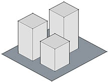
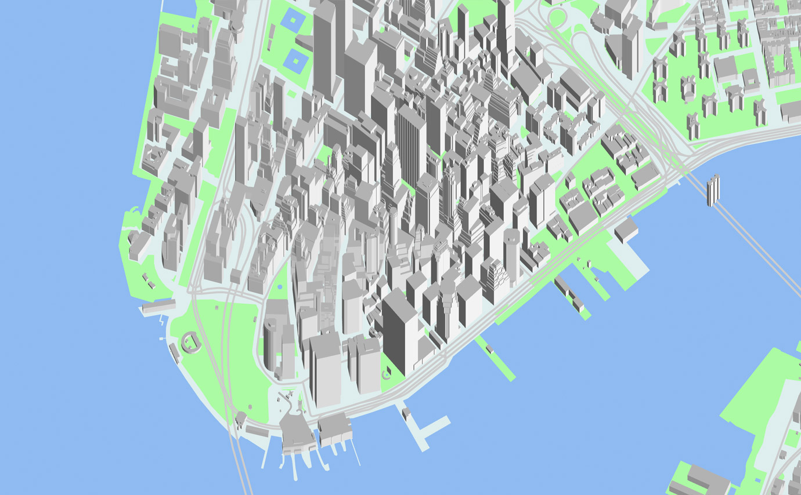
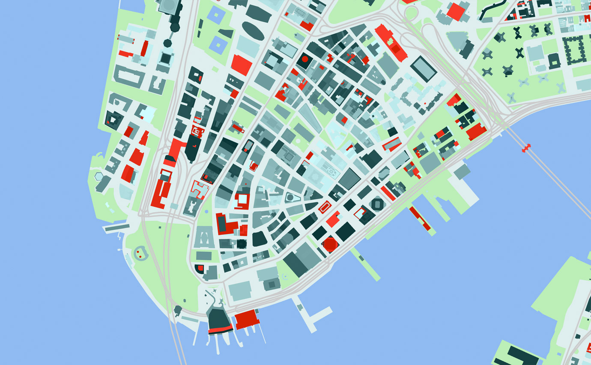

*This is a conceptual overview of Tangram's cameras. For a complete technical reference of camera configuration and parameters, see [cameras](../Syntax-Reference/cameras.md).*

To control the view of the data being mapped, Tangram uses cameras similar to those found in other 3D applications and libraries, with a few twists to accommodate web map conventions.

Most 2D web maps control their view area with a "zoom level", which sets the viewable area of a map and determines which map tiles to load. However, in most 3D contexts (including real life), what you see through a camera is dependent on its position, focal length, and field of view, and there isn't a strict analogue to zoom level.

To support zoom levels in a 3D context, our perspective camera allows position, field of view, and zoom level to be interdependent – each parameter can affect the others in ways that 3D cameras don't normally allow.

Apart from this, our cameras should be recognizable to anyone familiar with 3D. (You can't currently rotate or tilt our cameras.)

## Camera types

Tangram has three camera types: `perspective`, `isometric`, and `flat`. In most ways they are like typical 3D cameras, with some limitations and enhancements to make them better suited to displaying maps. For instance, because Tangram JS is a Leaflet plugin, for now you can't tilt or rotate the cameras. Also, their position is set with _[lat, long, zoom]_ instead of 3D coordinates.

### perspective camera
The **perspective** camera is the most like a 3D camera, but with some unique parameters, including `focal_length` and `vanishing_point`.

```yaml
cameras:
    camera1:
        type: perspective
```

[  ](http://tangrams.github.io/tangram-frame/?url=http://tangrams.github.io/tangram-docs/cameras/perspective.yaml)

#### `focal_length`
The `focal_length` parameter is connected to the camera's height, and they modify each other in order to maintain a consistent view area. This allows the "zoom level" of a particular map view to remain constant unless changed directly. (You might know this trick as a "[dolly zoom](https://en.wikipedia.org/wiki/Dolly_zoom)", first used in Hitchcock's _Vertigo_.)

The effect of changing the `focal_length` is therefore identical to scaling the height of all 3D objects in the scene, but without changing the geometry at all.

Here's a diagram of a typical perspective view:  


With our perspective camera, if you decrease the `focal_length`, the camera will move toward the model, to keep the field of view consistent:  


```yaml
cameras:
    camera1:
        type: perspective
        focal_length: .5
```

[  ](http://tangrams.github.io/tangram-docs/map/?cameras/focal_length.yaml)

#### `vanishing_point`
The perspective camera also allows the apparent origin of perspective (aka the vanishing point) to be changed – this produces an effect you would normally only get by pointing the camera somewhere else and cropping the resulting view.

```yaml
cameras:
    camera1:
        type: perspective
        vanishing_point: [1000,-1000]
```

[  ](http://tangrams.github.io/tangram-docs/map/?cameras/vanishing_point.yaml)

### isometric camera

Also called an orthographic or parallel projection, the **isometric** camera can be thought of as a perspective camera with an infinitely long focal length. It produces a flattened perspective that can resemble satellite photos, or the view through a telephoto lens.




[  ](http://tangrams.github.io/tangram-docs/map/?cameras/isometric.yaml)

```yaml
cameras:
    camera1:
        type: isometric
```
#### axis

The isometric camera allows modification to the orthographic axis, to produce effects which would normally require moving and rotating the camera.

```yaml
cameras:
    camera1:
        type: isometric
        axis: [1, 1]
```

[  ](http://tangrams.github.io/tangram-docs/map/?cameras/axis.yaml)

### flat camera

The **flat** camera is a shortcut to a view which can be produced by the other two cameras, but is simpler to setup and use. It has no 3D perspective at all, and shows a perfectly flat top-down view of your map.

```yaml
cameras:
    camera1:
        type: flat
```
[  ](http://tangrams.github.io/tangram-docs/map/?cameras/flat.yaml)

