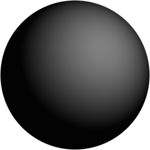
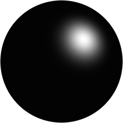
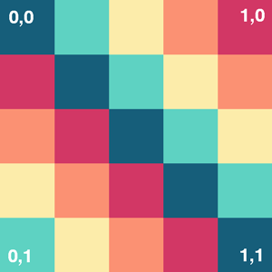
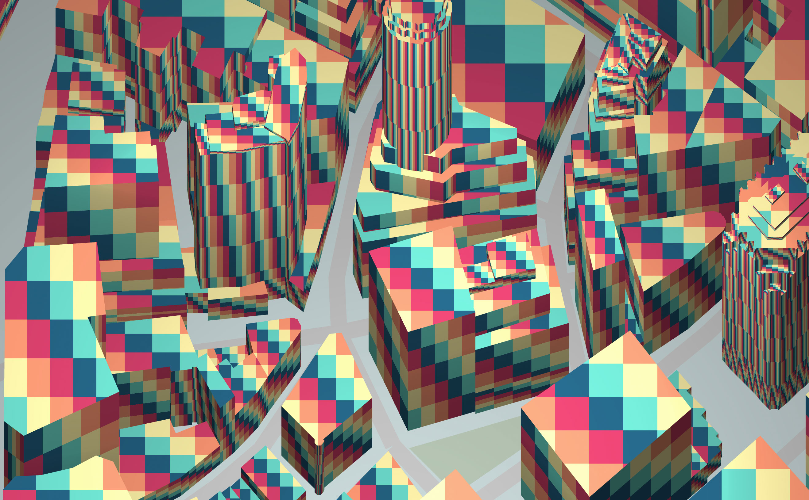
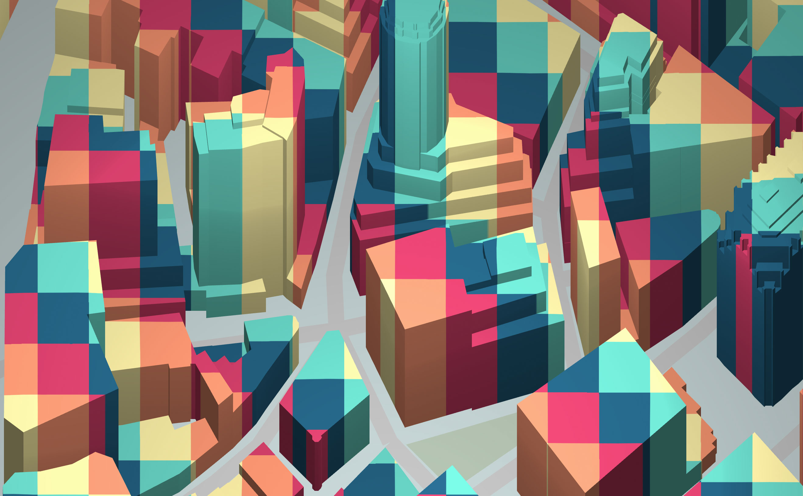
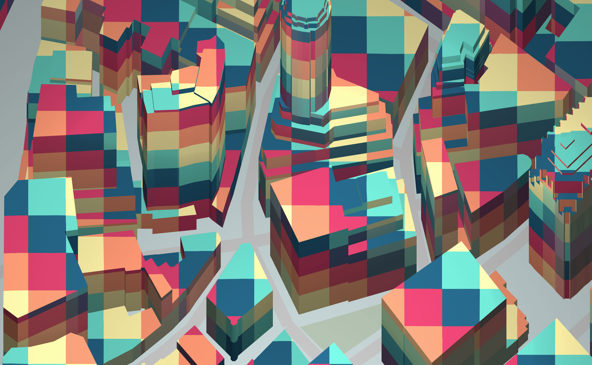

*This is the conceptual overview for Tangram's materials system. For technical reference, see the [Materials page](../Syntax-Reference/materials.md).*

Materials describe how an object responds to illumination by [lights](Lights-Overview.md). In the [OpenGL lighting model](https://en.wikipedia.org/wiki/Blinn%E2%80%93Phong_shading_model), lights can emit ***diffuse***, ***ambient***, or ***specular*** light components (often known as "terms"), and the properties of a material describe how (or whether) an object will reflect those terms.

The most common material properties control the reflection of those three terms, and share their names:

### `diffuse`
This is the primary color of an object as it would appear in pure white light, in the absence of highlights. By default: `diffuse: white`.

```yaml
lights:
    light1:
        type: point
        position: [1,1,2.4]
        ambient: white
        diffuse: white
        specular: white

styles:
    stylename:
        material:
            diffuse: 0.5
            ambient: 0
            specular: 0
```



### `ambient`
This is is the color of the object in the presence of ambient light. By default, the ambient color will be the same as the `diffuse` value, unless otherwise specified.

```yaml
lights:
    light1:
        type: point
        position: [1,1,2.4]
        ambient: white
        diffuse: white
        specular: white

styles:
    stylename:
        material:
            emission: 0
            ambient: 0.5
            diffuse: 0
            specular: 0
            shininess: 0.2
```


### `specular`
In our lighting model, "specular" is the "highlight" color of a material. It can be thought of as the reflection of the light source itself on the surface of an object. The `shininess` parameter controls the size of the highlight: larger numbers produce smaller highlights, which makes the object appear shinier.

By default, these are set to `specular: 0` and `shininess: 0.2`

```yaml
lights:
    light1:
        type: point
        position: [1,1,2.4]
        ambient: white
        diffuse: white
        specular: white

styles:
    stylename:
        material:
            diffuse: 0.0
            ambient: 0
            specular: 0.5
        shininess: 2.0
```




### `emission`
When an `emission` color is set, the object will take on that color independent of any lights, including ambient, as though it is glowing (although it will not illuminate neighboring objects, as it is not a true light source). By default, it is set to `emission: 0`.

```yaml
lights:
    light1:
        type: point
        position: [1,1,2.4]
        ambient: 0
        diffuse: 0
        specular: 0

styles:
    stylename:
        material:
            emission: [.9,.9,.9]
            ambient: 0
            diffuse: 0.0
```


## Textures

Material properties can be controlled with pixel-level detail when used with ***texture maps***.


Textures are loaded by setting the `texture` parameter to the url of an image or the name of an entry in the [`textures`](../Syntax-Reference/textures.md) block:

```yaml
material:
    diffuse:
        texture: ./images/grid.jpg
```

### Mapping
When using a texture, you must specify one of four `mapping` modes, which determine the method used to apply the texture to an object. In every case, texture coordinates are applied to the vertices of the geometry, and the image is drawn according to those coordinates.

### `mapping: uv`
UV mapping is related to the size and proportions of the geometry. With this method, a bounding box is applied to contiguous surfaces, and texture coordinates are applied to the corners of the bounding box. In the following example, a grid image is applied to each polygon. On larger shapes, the UVs are tiled, resulting in a tiled image.



```yaml
material:
    diffuse:
        texture: ./material/grid.jpg
        mapping: uv
```
[  ](http://tangrams.github.io/tangram-docs/map/?material/uv.yaml#19/40.70533/-74.00975)

### `mapping: planar`
Planar mapping uses only 2D world coordinates. As you can see the pattern is constant across surfaces that face up but is stretched on the sides of geometries.

```yaml
material:
    diffuse:
        texture: /material/grid.jpg
        mapping: planar
        scale: 0.01
```

[  ](http://tangrams.github.io/tangram-docs/map/?material/planar.yaml#19/40.70533/-74.00975)

### `mapping: triplanar`
This is similar to `planar`, but along all three world-space axes. Where a face does not point directly along one axis, the result will be a blend of more than one axis; thus it is computationally more expensive.

```yaml
material:
    diffuse:
        texture: /material/grid.jpg
        mapping: triplanar
        scale: 0.01
```

[  ](http://tangrams.github.io/tangram-docs/map/?material/triplanar.yaml#19/40.70533/-74.00975)

### `mapping: spheremap`
A "spherical environment map", or "spheremap", is an unusual kind of mapping which is dependent on camera position. It uses a texture to color faces depending on their relative angle to the camera. You can think of a spheremap as a hemisphere over the scene, on which the texture has been painted – each polygon in the scene is colored depending on the part of the texture at which it points.

In this example, all polygons which face straight toward the camera will be given the color at the center of the spheremap's texture: white. All polys which face south will be tinted blue, east green, west red, north yellow, and so on.


```yaml
material:
    diffuse:
        texture: /material/sem.jpg
        mapping: spheremap
```

[  ](http://tangrams.github.io/tangram-docs/map/?material/spheremap.yaml#19/40.70533/-74.00975)

### Other properties
Each `texture` can also have the following properties:

* `scale`: use for `uv`, `planar` and `triplanar`. This scales the value of the texture coordinates. Usually, bigger values result in smaller textures. Can be a single float value, or a two/three dimensional value. By default: `scale: [1,1]`

* `amount`: is a three dimensional vector or single float number that multiply the value of the texture in order to modulate the amount of brightness of the texture. By default: `amount: [1,1,1]`


### Normals

The `normal` of a polygon is a three-dimensional vector describing the direction that it is considered to be facing. The direction that a 3D plane is facing may seem obvious, but most 3D engines allow a polygon's apparent direction to be changed without modifying the geometry, which is useful in many situations.

Tangram's polygon model assigns normals to the vertices at the corners of a polygon when the geometry is constructed, and these values are interpolated across the face of the polygon to calculate the normal at any given point. This information is used as part of the diffuse and specular lighting calculations.

The `material` implementation allows you to modify these normals with a "normal map" `texture`, using the `mapping` modes `uv`, `planar`, or `triplanar`. This can produce the illusion of far greater detail than exists in the model itself.

Here is an example of a normal map, produced with a third-party 3D application:


And here is the normal map assigned with the `uv` mapping to the building layer:

```yaml
material:
    normal:
        texture: /material/rock.jpg
        mapping: uv
    ambient: 0.8
    diffuse: 1
    specular: 0
```

[  ](http://tangrams.github.io/tangram-docs/map/?material/normals.yaml#19/40.70533/-74.00975)

# Composition

Any of these `material` properties is magical on its own, but even more sophisticated effects become possible when combining them. You will need to experiment to find the right combination to produce the effect that you want.

This example modifies the normal values of the water layer with a glsl `shader`, then applies a `spheremap` to it:

```yaml
material:
    ambient: .7
    diffuse:
        texture: /material/sky.jpg
        mapping: spheremap
shaders:
    blocks:
        global: |
                vec3 random3(vec3 c) {
                    float j = 4096.0*sin(dot(c,vec3(17.0, 59.4, 15.0)));
                    vec3 r;
                    r.z = fract(512.0*j);
                    j *= .125;
                    r.x = fract(512.0*j);
                    j *= .125;
                    r.y = fract(512.0*j);
                    return r-0.5;
                }

                const float F3 =  0.3333333;
                const float G3 =  0.1666667;
                float snoise(vec3 p) {

                    vec3 s = floor(p + dot(p, vec3(F3)));
                    vec3 x = p - s + dot(s, vec3(G3));

                    vec3 e = step(vec3(0.0), x - x.yzx);
                    vec3 i1 = e*(1.0 - e.zxy);
                    vec3 i2 = 1.0 - e.zxy*(1.0 - e);

                    vec3 x1 = x - i1 + G3;
                    vec3 x2 = x - i2 + 2.0*G3;
                    vec3 x3 = x - 1.0 + 3.0*G3;

                    vec4 w, d;

                    w.x = dot(x, x);
                    w.y = dot(x1, x1);
                    w.z = dot(x2, x2);
                    w.w = dot(x3, x3);

                    w = max(0.6 - w, 0.0);

                    d.x = dot(random3(s), x);
                    d.y = dot(random3(s + i1), x1);
                    d.z = dot(random3(s + i2), x2);
                    d.w = dot(random3(s + 1.0), x3);

                    w *= w;
                    w *= w;
                    d *= w;

                    return dot(d, vec4(52.0));
                }

        normal: |
            normal += snoise(vec3(worldPosition().xy*0.08,u_time*.5))*0.02;
```

[  ](http://tangrams.github.io/tangram-docs/map/?material/dynamic-normals.yaml)
