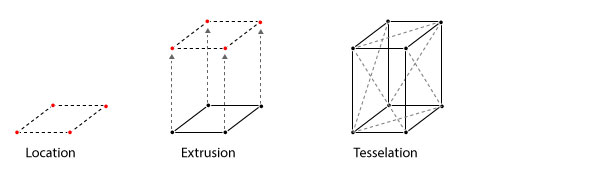
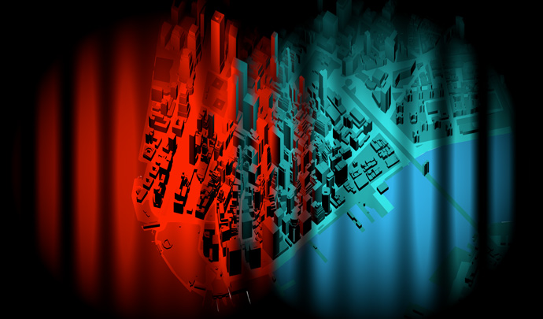
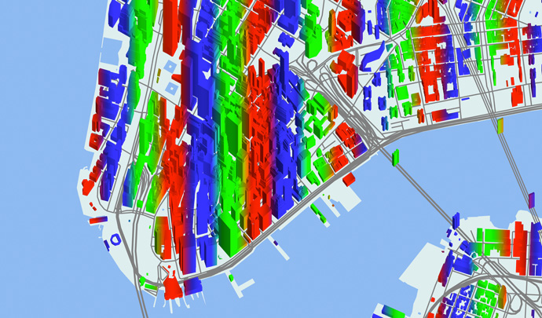
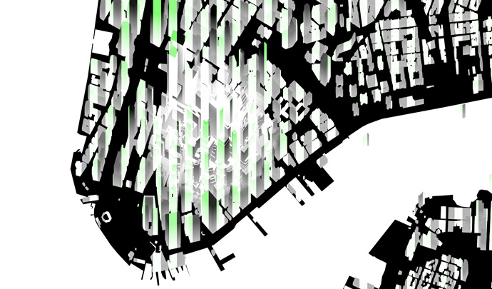

# Shaders

The world of graphics shaders is vast and arcane. It has been the exclusive domain of demoscene and video game coders for decades. We want to bring this world to casual mappers, to harness the power of the GPU in service of more useful and cooler-looking maps.

The basic idea is this: your screen has lots of pixels which all need to be updated very rapidly. This job is handled by the GPU (graphics processing unit), which is a specialized chip which runs simple programs called “shaders.” These shaders compute the color of every pixel on your screen nigh-simultaneously, many times a second. Nearly every modern PC, laptop, and smartphone has a GPU in it, and they all run shaders.

These shaders are written using a “shading language” – Tangram uses the openGL shader language, or GLSL. Learning to code in this language has its particularities because of its parallel nature. If you are new to it we encourage you to check out [The Book of Shaders](http://thebookofshaders.com), a easy step-by-step introduction to GLSL programming.

## Shaders inside Tangram

Each of the [styles](Styles-Overview.md) on Tangram is related to both a geometry builder and at least one shader. The builders produce geometry which is formatted in a specific way and sent to the GPU where the shaders process and display it. This series of steps is known as a "pipeline."

### Builders

In the builder step, the data coming from the data source is positioned, extruded, and tessellated.



Here is some example data:
```json
{
    "geometry": {
         "type": "Polygon",
         "coordinates": [
             [
                [ -74.017923, 40.711239 ],
                [ -74.017853, 40.711423 ],
                [ -74.017079, 40.711252 ],
                [ -74.017149, 40.711069 ],
                [ -74.017923, 40.711239 ]
             ]
         ]
    },
    "type": "Feature",
    "id": "76abbd6eea",
    "properties": {
        "name": "Gateway Plaza 400",
        "height": 88
    }
} 
```
### Shader

The Tangram Engine is designed to let you interact with and modify this pipeline at specific points. In order to customize your own shaders it is important to know what this pipeline looks like, and where you can change things.


Looking closely at the steps in the previous diagram you will note some red arrows – they correspond to the *position*, *normal*, *color*, and *filter* steps. Those steps are points where the user can add a `block` of code.

There is another `block` type called `global`, where you can add global variables and functions to be used in later blocks.

#### `position`

In this block you can move the vertices of the geometry. This block will be added to the *vertex* shader, where it has access to the `position` variable, with the format `vec4(x, y, z, w)`, in Mercator-projected meters, relative to the center of the view. In the following example, the top vertices of the building are displaced with a combination of sine waves.

```yaml
styles:
    buildings:
        base: polygons
        animated: true
        material:
            ambient: 1.0
            diffuse: 1.0
        shaders:
            blocks:
                position: |
                    vec3 pos = worldPosition().xyz*0.1;
                    if(position.z > 0.){
                        position.xyz += vec3(cos(pos.x+u_time)*5.,
                                         sin(pos.y+u_time)*5.,
                                         sin(pos.x+u_time)*10.+
                                         cos(pos.y+u_time)*5. );
                    }
```

[  ](http://tangrams.github.io/tangram-docs/?shaders/position.yaml)

#### `normal`

In this `block` you can change the `normal` value of a surface pixel by pixel. The `normal` variable is a `vec3(x, y, z)`, where the final value is the normalized vector (aka an angle) produced by the combination of the three axes. In the below example, two lights (blue and purple) are lighting the scene from different directions. The surface normals of the buildings are being modified on the fly to point in different directions, which changes the reflected color. 

```yaml
styles:
    buildings:
        base: polygons
        animated: true
        material:
            ambient: 1.0
            diffuse: 1.0
        shaders:
            blocks:
                normal: |
                    vec3 pos = worldPosition().xyz*0.1;
                    normal.xyz += vec3( cos(pos.x+u_time)+
                                        cos(pos.x*0.5+u_time*2.0),
                                        sin(pos.y*2.0+u_time*0.4)*0.54+
                                        sin(pos.y*1.5+u_time*0.7),
                                        sin(pos.z*0.7+u_time*1.5)+
                                        cos(pos.z+u_time)*1.1 )*0.5;
                    normal = normalize(normal);
```

[  ](http://tangrams.github.io/tangram-docs/?shaders/normal.yaml)

#### `color`

In this `block` you can change the `color` value of a surface pixel by pixel, pre-lighting. The `color` variable is a `vec4(r,g,b,a)`.

```yaml
styles:
    buildings:
        base: polygons
        animated: true
        material:
            ambient: 1.0
            diffuse: 1.0
        shaders:
            blocks:
                global: |
                    float random(in vec3 _st){ 
                        return fract(sin(dot(_st.xyz,
                                             vec3(12.9898,78.233,32.4355)))* 
                            43758.5453123);
                    }

                    vec3 hsb2rgb( in float hue, in float sat, in float bri ){
                        vec3 rgb = clamp(abs(mod(hue*6.0+vec3(0.0,4.0,2.0),
                                                 6.0)-3.0)-1.0, 
                                         0.0, 
                                         1.0 );
                        rgb = rgb*rgb*(3.0-2.0*rgb);
                        return bri * mix(vec3(1.0), rgb, sat);
                    }
                color: |
                    vec3 pos = worldPosition().xyz*0.05;
                    color.xyz *= hsb2rgb( random(abs(floor(pos))) , .5, .8 );
```

[  ](http://tangrams.github.io/tangram-docs/?shaders/color.yaml)

#### `filter`

In this `block` you can change the `color` value of a surface pixel by pixel, post-lighting. The `color` variable is a `vec4(r,g,b,a)`. This is the right place to apply effects like crosshatching, color adjustments, and halftones.

```yaml
styles:
    buildings:
        base: polygons
        animated: true
        material:
            ambient: 1.0
            diffuse: 1.0
        shaders:
            blocks:
                global: |
                    float random(in vec3 _st){ 
                        return fract(sin(dot(_st.xyz,
                                             vec3(12.9898,78.233,32.4355)))* 
                            43758.5453123);
                    }

                    vec3 hsb2rgb( in float hue, in float sat, in float bri ){
                        vec3 rgb = clamp(abs(mod(hue*6.0+vec3(0.0,4.0,2.0),
                                                 6.0)-3.0)-1.0, 
                                         0.0, 
                                         1.0 );
                        rgb = rgb*rgb*(3.0-2.0*rgb);
                        return bri * mix(vec3(1.0), rgb, sat);
                    }
                filter: |
                    vec3 pos = worldPosition().xyz*0.05;
                    color.xyz = hsb2rgb( random(abs(floor(pos))) , .5, .8 );
```

[  ](http://tangrams.github.io/tangram-docs/?shaders/filter.yaml)

#### Defines and Uniforms

Beside modifying the pipeline at the pre-defined block points, you can also *define* macros or pass *uniforms* to both the vector and fragment shaders. This can be done with the following higher layer properties.

**Defines** are GLSL preprocessor statements which are injected into shader code at compilation time. The `defines` block allows you to set and define custom statements, useful for setting flags or switches to change the functionality of a shader without modifying the shader code directly.

For example:

```yaml
shaders:
    defines:
        EFFECT_NOISE_ANIMATED: true
```

Will be injected into the shader as:

`#define EFFECT_NOISE_ANIMATED`


**Uniforms**, on the other hand, are declared as key-value pairs, and can be set through the JavaScript API. This allows real-time interaction with shaders, e.g. with a GUI. Types are inferred by Tangram, and the corresponding uniform declarations are injected into the shaders automatically.

For example, float and vector uniform types can be added as follows:

```yaml
shaders:
    uniforms:
        u_speed: 2.5
        u_color: [.5, 1.5, 0]
```

The uniforms `u_speed` and `u_color` are injected into the shader as these types:

```yaml
float u_speed;
vec3 u_color;
```

And are then assigned the following values:

```yaml
u_speed = 2.5;
u_color = vec3(0.5, 1.5, 0.0);
```

Tangram provides a set of [default uniforms](shaders.md#built-in-uniforms) that are useful for common shader-based calculations.
