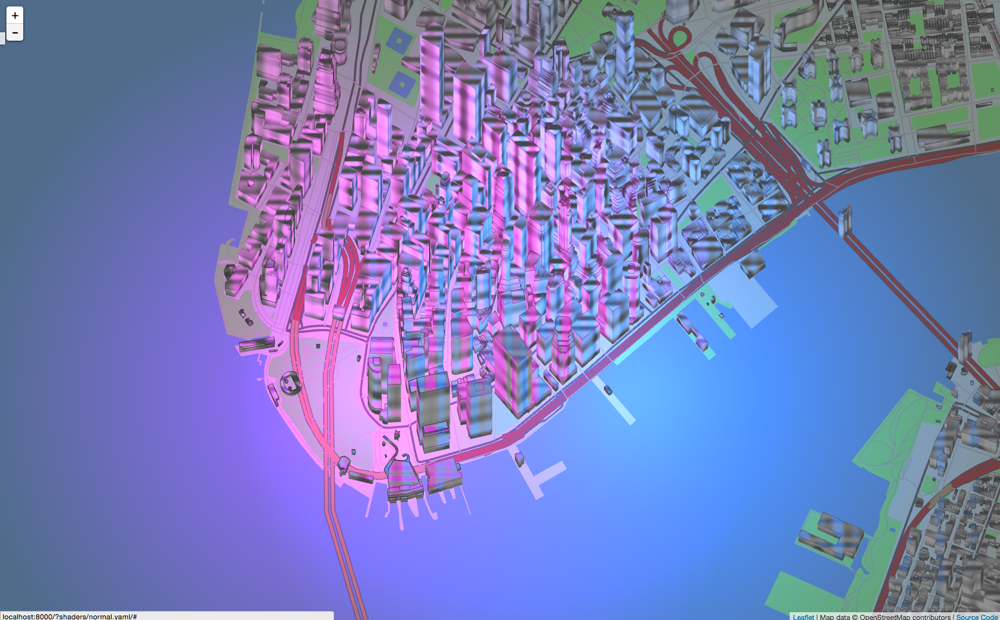

# Shaders

The world of graphics shaders is vast and arcane. It has been the exclusive domain of demoscene and video game coders for decades. We want to bring this world to casual mappers, to harness the power of the GPU in service of cooler-looking and more useful maps.

The basic idea is this: your screen has lots of pixels which all need to be updated many times a second. For many years this job was handled by CPUs, but CPUs are designed to do one thing at a time, and as computer games and other graphics-heavy applications became more sophisticated, CPUs were no longer up to the task.

Arcade games had been using a separate chip called a GPU (graphical processing units) to handle pixel-drawing separately from the CPU since the 70s. GPUs are very good at doing one simple things many times at once they run a simple program called a “shader” for every pixel on your screen simultaneously, many times a second.

GPUs started migrating to PCs in the 80s, and by the 90s were very common. Today nearly every PC, laptop, and phone has a graphics chip on it, and they all run shaders.

This “shaders” are code using a “shading language” in our case, the openGL shader language or GLSL. Learning to code in this programing language have his own particularities because of it parallel nature. If you are new to it we encourage you to check [The Book of Shaders](http://thebookofshaders.com), a easy step-by-step introduction to GLSL programming.

## Shaders inside Tangram

Each one of the [styles](styles-overview.md) on Tangram is related to both a geometry builder and a shader. The geometries that builders produce (from incoming data source) is formatted in a specific way and pushed to the GPU where the shader receive it, processed and display it. This series of process and steps is known as a pipeline.

### Geometry Builders

```json
{
    "geometry": {
         "type": "Polygon",
         "coordinates": [
             [
                [ -74.017923, 40.711239 ],
                [ -74.017853, 40.711423 ],
                [ -74.017079, 40.711252 ],
                [ -74.017149, 40.711069 ],
                [ -74.017923, 40.711239 ]
             ]
         ]
    },
    "type": "Feature",
    "id": "76abbd6eea",
    "properties": {
        "name": "Gateway Plaza 400",
        "height": 88
    }
} 
```

In this step the data coming from the data source is located on a mercator projection, extruded and tessellated.


### Shader

The Tangram Engine is design to let the user interact and modify this pipeline in specific points. In order to customize your own shaders is important first to know what this pipeline looks like and where you can change things.


Looking closely to the steps on the previous diagram you will note some red arrows, they correspond to the *position*, *normal*, *color* and *filter* steps. Those steps are moments where the user can add a `block` of code.

There is another `block` type call `global`, where the user can add global variables and functions to be use further into another block. 

#### `position`

In this block you can move vertices of the geometry. This block will be added to the *vertex* shader and have access to the `vec4` call `position` variable. Is important to remember that the format of it is: `vec4(x, y, z, w)`. In the bellow example the top vertices of the building are beeb displace in at different frequencies.

```yaml
styles:
    buildings:
        base: polygons
        animated: true
        material:
            ambient: 1.0
            diffuse: 1.0
        shaders:
            blocks:
                position: |
                    vec3 pos = v_world_position.xyz*0.1;
                    if(position.z > 0.){
                        position.xyz += vec3(cos(pos.x+u_time)*5.,
                                         sin(pos.y+u_time)*5.,
                                         sin(pos.x+u_time)*10.+
                                         cos(pos.y+u_time)*5. );
                    }
```

[  ](http://tangrams.github.io/tangram-docs/?shaders/position.yaml)

#### `normal`

In this `block` you can change the `normal` value of a surface pixel by pixel, because this is happening on the pixel or fragment shader. The `normal` variable is a `vec3(x, y, z)`. If you pay attention to what's happening on the example you will note two lights (blue and purple). One on each side of the screen. The surface normals of the buildings are been modify on the fly, to look in a different direction, that cause the changing on color. 

```yaml
styles:
    buildings:
        base: polygons
        animated: true
        material:
            ambient: 1.0
            diffuse: 1.0
        shaders:
            blocks:
                normal: |
                    vec3 pos = v_world_position.xyz*0.1;
                    normal.xyz += vec3( cos(pos.x+u_time)+
                                        cos(pos.x*0.5+u_time*2.0),
                                        sin(pos.y*2.0+u_time*0.4)*0.54+
                                        sin(pos.y*1.5+u_time*0.7),
                                        sin(pos.z*0.7+u_time*1.5)+
                                        cos(pos.z+u_time)*1.1 )*0.5;
                    normal = normalize(normal);
```

[  ](http://tangrams.github.io/tangram-docs/?shaders/normal.yaml)

#### `color`

In this `block` you can change the `color` value of a surface pixel by pixel, because this is happening on the pixel or fragment shader. The `color` variable is a `vec4(r,g,b,a)`. Is important to remember that this change is previous to the computation of the lighting. If you see the above examples you will note that one sides of the buildings are shaded regarding their color.

```yaml
styles:
    buildings:
        base: polygons
        animated: true
        material:
            ambient: 1.0
            diffuse: 1.0
        shaders:
            blocks:
                globals: |
                    float random(in vec3 _st){ 
                        return fract(sin(dot(_st.xyz,
                                             vec3(12.9898,78.233,32.4355)))* 
                            43758.5453123);
                    }

                    vec3 hsb2rgb( in float hue, in float sat, in float bri ){
                        vec3 rgb = clamp(abs(mod(hue*6.0+vec3(0.0,4.0,2.0),
                                                 6.0)-3.0)-1.0, 
                                         0.0, 
                                         1.0 );
                        rgb = rgb*rgb*(3.0-2.0*rgb);
                        return bri * mix(vec3(1.0), rgb, sat);
                    }
                color: |
                    vec3 pos = v_world_position.xyz*0.05;
                    color.xyz *= hsb2rgb( random(abs(floor(pos))) , .5, .8 );
```

[  ](http://tangrams.github.io/tangram-docs/?shaders/color.yaml)

#### `filter`

In this `block` you can change the `color` value after the lightening of a surface pixel by pixel, because this is happening on the pixel or fragment shader. The `color` variable is a `vec4(r,g,b,a)`. Because this change is happening  after the lighting overwriting this values will not have light calculations. This is the right place to apply `filter` effect like crosshatching, lookup tables and halftones, etc.

```yaml
styles:
    buildings:
        base: polygons
        animated: true
        material:
            ambient: 1.0
            diffuse: 1.0
        shaders:
            blocks:
                globals: |
                    float random(in vec3 _st){ 
                        return fract(sin(dot(_st.xyz,
                                             vec3(12.9898,78.233,32.4355)))* 
                            43758.5453123);
                    }

                    vec3 hsb2rgb( in float hue, in float sat, in float bri ){
                        vec3 rgb = clamp(abs(mod(hue*6.0+vec3(0.0,4.0,2.0),
                                                 6.0)-3.0)-1.0, 
                                         0.0, 
                                         1.0 );
                        rgb = rgb*rgb*(3.0-2.0*rgb);
                        return bri * mix(vec3(1.0), rgb, sat);
                    }
                filter: |
                    vec3 pos = v_world_position.xyz*0.05;
                    color.xyz = hsb2rgb( random(abs(floor(pos))) , .5, .8 );
```

[  ](http://tangrams.github.io/tangram-docs/?shaders/filter.yaml)

#### Defines and Uniforms

Beside the pre-defines blocks points, the user have the option to *define* macros or pass *uniforms* to both the vector and fragment shader. That can be done with the following higher layer properties.

**Defines** are GLSL preprocessor statements, which are injected into shader code at compilation time. The `defines` block allows you to set and define custom statements, useful for changing the functionality of a shader without modifying the shader code directly.

For more on defines, see [link](link).

```yaml
shaders:
    defines:
        EFFECT_NOISE_ANIMATED: true
```

The following is a list of reserved defines used by the Tangram Engine:

```
TEXTURE_COORDS
FEATURE_SELECTION
WORLD_POSITION_WRAP

TANGRAM_MATERIAL_EMISSION
TANGRAM_MATERIAL_EMISSION_TEXTURE
TANGRAM_MATERIAL_EMISSION_TEXTURE_UV
TANGRAM_MATERIAL_EMISSION_TEXTURE_PLANAR
TANGRAM_MATERIAL_EMISSION_TEXTURE_TRIPLANAR
TANGRAM_MATERIAL_EMISSION_TEXTURE_SPHEREMAP
TANGRAM_MATERIAL_AMBIENT
TANGRAM_MATERIAL_AMBIENT_TEXTURE
TANGRAM_MATERIAL_AMBIENT_TEXTURE_UV
TANGRAM_MATERIAL_AMBIENT_TEXTURE_PLANAR
TANGRAM_MATERIAL_AMBIENT_TEXTURE_TRIPLANAR
TANGRAM_MATERIAL_AMBIENT_TEXTURE_SPHEREMAP
TANGRAM_MATERIAL_DIFFUSE
TANGRAM_MATERIAL_DIFFUSE_TEXTURE
TANGRAM_MATERIAL_DIFFUSE_TEXTURE_UV
TANGRAM_MATERIAL_DIFFUSE_TEXTURE_PLANAR
TANGRAM_MATERIAL_DIFFUSE_TEXTURE_TRIPLANAR
TANGRAM_MATERIAL_DIFFUSE_TEXTURE_SPHEREMAP
TANGRAM_MATERIAL_SPECULAR
TANGRAM_MATERIAL_SPECULAR_TEXTURE
TANGRAM_MATERIAL_SPECULAR_TEXTURE_UV
TANGRAM_MATERIAL_SPECULAR_TEXTURE_PLANAR
TANGRAM_MATERIAL_SPECULAR_TEXTURE_TRIPLANAR
TANGRAM_MATERIAL_SPECULAR_TEXTURE_SPHEREMAP
TANGRAM_MATERIAL_NORMAL_TEXTURE
TANGRAM_MATERIAL_NORMAL_TEXTURE_UV
TANGRAM_MATERIAL_NORMAL_TEXTURE_PLANAR
TANGRAM_MATERIAL_NORMAL_TEXTURE_TRIPLANAR
TANGRAM_LIGHTING_VERTEX
TANGRAM_LIGHTING_FRAGMENT
TANGRAM_POINTLIGHT_ATTENUATION_EXPONENT
TANGRAM_POINTLIGHT_ATTENUATION_INNER_RADIUS
TANGRAM_POINTLIGHT_ATTENUATION_OUTER_RADIUS
TANGRAM_SPOTLIGHT_ATTENUATION_EXPONENT
TANGRAM_SPOTLIGHT_ATTENUATION_INNER_RADIUS
TANGRAM_SPOTLIGHT_ATTENUATION_OUTER_RADIUS
```

**Uniforms**, on other side, are declared as key-value pairs; types are inferred by the [YAML](yaml.md) parser, and the corresponding uniform declarations are injected into the shaders automatically.

```yaml
shaders:
    uniforms:
        u_color: vec3(.5, .5, .5)
        u_speed: 2.5
```

The following are default uniforms present on the _vertex_ and _fragment_ shaders:

```glsl
uniform mat4 u_model;
uniform mat4 u_modelView;
uniform mat3 u_normalMatrix;

uniform vec2 u_resolution;
uniform vec2 u_aspect;
uniform vec2 u_map_center;
uniform vec2 u_tile_origin;

uniform float u_meters_per_pixel;
uniform float u_map_zoom;
uniform float u_time;
```

The following _varyings_ are pass from the _vertex_ to the _fragment_ shader:

```glsl
varying vec4 v_position;
varying vec3 v_normal;
varying vec4 v_color;
varying vec4 v_world_position;

#if defined(TEXTURE_COORDS)
varying vec2 v_texcoord;
#endif
```