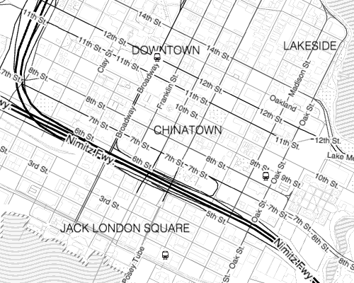

[Tangram](https://mapzen.com/projects/tangram) is a flexible mapping engine, designed for real-time rendering of 2D and 3D maps from vector tiles. Built around [OpenStreetMap](http://www.openstreetmap.org/) data, Tangram provides optional control over almost every aspect of the map-making process, including cartography, lighting, and geometry customization.

Map styles, data filters, labels, and even graphics card code can be defined in a human-readable and -writable plain-text [scene file](Scene-file.md), and APIs permit direct interactive control of the style. Changing the color is just the beginning; every Tangram map is a 3D scene, so you also can modify [lights](Lights-Overview.md) and [cameras](Cameras-Overview.md).

Tangram is designed to use vector data sources such as Mapzen’s free [vector tile service](https://mapzen.com/projects/vector-tiles), which is a tiled, hosted version of the OpenStreetMap database. Besides points and lines, these data sources contain metadata, which Tangram can use to [filter](Filters-Overview.md) the data and change drawing styles in real time.

All of these effects are possible thanks to [OpenGL](https://en.wikipedia.org/wiki/OpenGL). You can write graphics card programs, known as [shaders](Shaders-Overview.md), and even JavaScript to add interactivity, mix data sources, and control the design of your maps.

Tangram is available in two delicious flavors: Tangram JS for browser-based mapping, and Tangram ES for native mobile mapping.

A variety of demos are available at https://mapzen.com/projects/tangram. Tangram is free and open source, is available for both commercial and non-commercial purposes. The [source code](https://github.com/tangrams) is open to view and modify, and contributions are welcomed.  

Learn more about the concepts, objects, and parameters of the scene file in the topics in the sidebar. Or, to jump right in, follow this [walkthrough](walkthrough.md) to learn how to make a map with Tangram JS.