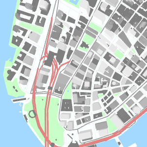
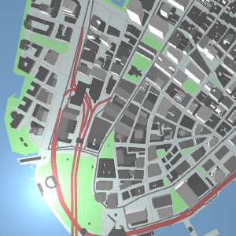
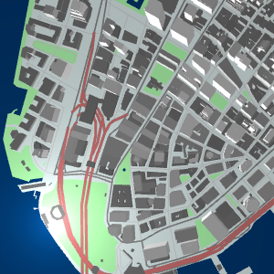

# Walkthrough: Make a map with Tangram

With the [Tangram map renderer](https://mapzen.com/projects/tangram), you quickly can make beautiful and useful 2D and 3D maps. With easy customizations, you can have fine control over almost every aspect of your map's appearance, including symbols, lighting, geometry, and feature labels, and see your changes immediately. Tangram is [open source](https://github.com/tangrams/tangram), and supports several vector data formats.

Follow this step-by-step walkthrough to make your first Tangram map. You will get a sample Tangram map running on your machine and be able to make simple changes to the map's appearance by editing a few lines of code. After you are done styling the map, you can host it on a website to share it with others.

To complete this walkthrough, you need a [browser that supports WebGL](https://get.webgl.org/), a text editor, and [Python](https://www.python.org/downloads/), which may already be installed as part of your operating system. You will need to maintain an Internet connection while you are working so you can access the map source data, which is being streamed from Mapzen's servers. While the steps are written for a Mac, you could use other operating systems as long as you can run a web server locally. It should take you about an hour to complete the exercises.

### View the Tangram example map

1. Open a browser to the [Tangram sample website](https://tangrams.github.io/simple-demo/). This is an example map showing some of the basic features of Tangram. By default, the map opens to the southern (lower) tip of Manhattan in New York City, United States.
2. Use your mouse to pan and zoom the map. Take note of the map's appearance, as you will be updating the scene later in the exercise.

	

3. Close the browser.

### Download the Tangram simple-demo repository

The style files are stored in a GitHub software repository called tangrams/simple-demo.

1. Navigate to [https://github.com/tangrams/simple-demo](https://github.com/tangrams/simple-demo).
2. Clone the simple-demo repository. You can choose to download the .zip file from the link on the page, or [clone the repository](https://help.github.com/articles/cloning-a-repository/) using the GitHub client application or command line utilities. Access to the repository is public, so you do not need to be signed in with a GitHub account.

> Tip: If you are new to GitHub, you can review its documentation at https://help.github.com/ to learn more about how to clone and work with repositories.

### Set up Tangram to run from your machine

You were viewing the demo on a remote server before, but now you will set it up to run from a web server on your own machine. This will allow you to make changes to the Tangram styles and immediately see the results. To start the server, you will need to enter a few command line instructions using the terminal window. You will need a web server, rather than attempting to open the simple-demo index.html file directly in a browser. Using your own server allows you to run JavaScript and work with the Tangram demo properly.

When you are running the demo locally, the map styling information (scene.yaml) and the files used to build the webpage (such as index.html) are coming from your machine. However, the underlying map data is vector tiles from Mapzen’s servers.

[Vector tiles](https://mapzen.com/projects/vector-tiles) are square-shaped collections of geographic data that contain the map feature geometry, such as lines and points. Information about how map features are drawn is maintained in a separate stylesheet file. For many purposes, vector tiles are more flexible than raster tiles, which are images that already have the visual appearance of the map features integrated in them. The steps in this walkthrough would be different with raster tiles because you would also need to regenerate the tile images themselves each time you made a change to the styling, rather than only updating the stylesheet.

> Tip:  By default, terminal windows open into your home directory, so you will need to drill into the folder structure to get to the simple-demo folder. Alternatively, add a shortcut to your context menu so you can right-click a folder in Finder and start the terminal window in that location. To enable this, open System Preferences, click Keyboard, and click Shortcuts. In the list, click Services and check New Terminal at Folder.

1. Open a terminal window to the simple-demo folder. You can type `cd` and the pathname to navigate to the proper directory path.
2. At the prompt, type `python -m SimpleHTTPServer` to start a web server using Python. You should receive a message similar to this in the terminal: `Serving HTTP on 0.0.0.0 port 8000 ...`
3. Open your browser to `http://localhost:8000`. (“Localhost” is a shortcut hostname that a computer can use to refer to itself, and is not viewable by anyone else.) If it was successful, you should see the same demo map as you viewed earlier. If you are having problems, you can instead try the command `python -m http.server 8000` (for use with Python 3).

Your terminal window might look something like this.

```
~/downloads $ git clone https://github.com/tangrams/simple-demo.git
Cloning into 'simple-demo'...
remote: Counting objects: 388, done.
remote: Total 388 (delta 0), reused 0 (delta 0), pack-reused 388
Receiving objects: 100% (388/388), 3.13 MiB | 2.02 MiB/s, done.
Resolving deltas: 100% (145/145), done.
Checking connectivity... done.
~/downloads $ cd simple-demo
~/downloads/simple-demo $ python -m SimpleHTTPServer
Serving HTTP on 0.0.0.0 port 8000 ...
```

Be sure to keep the terminal window open while you are working on this walkthrough.

### View the Tangram scene file

Tangram uses a human-readable format called `.yaml` to organize all the styling elements needed to draw a map. This file, known as a scene, specifies the source of the data, which layers from that source to display on the map, and rules about how to draw those layers, such as color and line thickness.

Beyond the steps in this walkthrough, you can play with other elements and their values, if you’d like. If the map is blank after you have changed something in the .yaml, you may have entered an errant value that Tangram cannot interpret. Undo your edit and save it again, or roll back all changes to return to the original state of the scene file.

To open and edit the scene file, you need a text editor. Suggested text editor applications include [Atom - OS X, Windows, Linux](https://atom.io/); [Notepad++ - Windows](https://notepad-plus-plus.org/); [TextWrangler - OS X](http://www.barebones.com/products/textwrangler/); and  [Sublime - OS X, Windows, Linux; free trial](http://www.sublimetext.com/). While you can use the apps installed with your operating system, such as Notepad or TextEdit, they do not provide the helpful indentations, code coloring and autocomplete, or text alignment options found in the other editors. For TextEdit, you must go to the Format menu and click Make Plain Text to use the plain-text version of the file. Do not use an app that applies rich formatting, such as Word or Wordpad.

1. Open `scene.yaml` in a text editor and scroll through the elements.
2. Notice that the elements are arranged in a hierarchy, with the top level elements being `cameras`, `lights`, `sources`, and `layers`. Each of these has additional subelements underneath them. The [scene file documentation](Scene-file.md) has more information about the top-level elements in a scene file. (Some of the code has been omitted in the block below.)

	```
	cameras:
   		camera1:

	lights:
    	light1:

	sources:
    	osm:

	layers:
    	earth:
	```
This part of the walkthrough has given you an introduction to Tangram and the contents of the scene file.  Now, you will edit the scene file to change the map's lighting and symbols.

### Update the scene lighting

Lighting enables visual effects like making the map appear as if it is being illuminated by the sun, viewed after dark, or lit only by the beam of a flashlight. The appearance of light is also affected by the materials it shines on, but setting properties of materials is beyond the scope of this walkthrough.

Currently, the map has a light source defined as `directional`, which you can think of as being sunlight. In these steps, you will add a new `light` element that resembles a flashlight shining from above. Darkening a scene by dimming the lighting parameters is a quick way to simulate night conditions, but you may need to modify the symbol colors if you are truly designing a map for viewing at night.

1. In `scene.yaml`, under `lights:`, add a  new `light2:` element at the same level as `light1:`.

	```
	lights:
		light1:
			[...]
		light2:
	```
2. Define `light2` with the following parameters, being careful to indent the lines under `light2:` with a tab.

	```
	light2:
		visible: true
		type: point
		position: [-74.0170, 40.7031, 100]
		origin: world
		ambient: .3
		diffuse: 1
		specular: .2
	```
3. Save `scene.yaml` and refresh the map.

The `position` parameter defines a light originating at an x-,y- coordinate location and at a z-value in meters from the ground, giving the appearance of a light pointed at the tip of Manhattan. You can learn more about lights and their parameters from the [lights documentation](lights.md).


The updated map looks washed out and the new spot light is barely visible, so you can adjust `light1` to make the map look better.

1. Under `light1:`, change the `diffuse:` parameter to `.1`.
2. Change `ambient:` to `.3`. Your `lights:` section should look like this:

	```
	lights:
    		light1:
        		type: directional
        		direction: [0, 1, -.5]
        		diffuse: .1
        		ambient: .3
    		light2:
        		visible: true
        		type: point
        		position: [-74.0170, 40.7031, 100]
        		origin: world
        		ambient: .3
        		diffuse: 1
        		specular: .2
	```
3. Save `scene.yaml` and refresh the map.

	

In these steps, you blended lights to achieve different effects. However, if you want to turn off a light completely, you can set its `visible` property to `false.`

### Update the layers in the map

Tangram can render data from different vector tile formats, as well as from individual files, such as a GeoJSON. The simple-demo map uses [vector tiles](https://mapzen.com/projects/vector-tiles) that display OpenStreetMap data from Mapzen’s servers. You specify the URL to the data in the `sources:` block, which requires a type (a designation for the data format) and a URL to the server or file. You can find more examples in the [sources documentation](sources.md).

After you specify the source, you need to list the layers from that source that you want to draw on the map. Optionally, you can include filters based on attribute values within a layer, such as to draw only major roads, and styling information about how the features should be symbolized. To learn more about the available layers, see the [Mapzen vector tile service documentation](https://github.com/mapzen/vector-datasource/wiki/Mapzen-Vector-Tile-Service#layers).

You specify how the display the features in the layers in the `draw:` block. There, you can enter basic information about colors and symbol sizes, as well as use more complex drawing techniques. For example, you can define shading or animations, enter code blocks, or reference other `.yaml` files. You can also specify the drawing order of layers to put certain layers on top of others. For example, in `scene.yaml`, the earth polygon layer, which represents landmasses, has an order of 0, meaning it will be underneath all other layers. Layers with order values of greater numbers are drawn on top of those with smaller numbers.

1. In `scene.yaml`, review the items under `layers:` to see which layers and feature types (`kind:`) are displayed in the map, and review the `draw:` block under each layer.
2. Under `water:`, change the `color:` value to `'#003366'`. Be sure to enclose the value in single quotation marks. Your `water:` block should look like this.
```
[...]
water:
		data: { source: mapzen }
		draw:
				polygons:
						order: 2
						color: '#003366'
[...]
```
3. Save `scene.yaml` and refresh the browser to see the updates.

	

If you want to continue experimenting with Tangram symbols, try changing the `draw` values of other layers. For more on available drawing parameters, see the [styles documentation](styles.md).

When you are done, close the terminal window to shutdown the server and close your browser.

## Put your Tangram map on the web

Now that you have made changes to the scene locally, you may want to share your map on a website. The next part of the walkthrough describes how to get your map on the web.

If you prefer, you can skip this part of the walkthrough.

There are many options for getting a map on the web. For example, if you have your own web hosting service, you can use that. An alternative is to use the free hosting service from GitHub called [GitHub Pages](https://pages.github.com/), which is what this walkthrough will use. These instructions show you how to get your Tangram map on the web through GitHub Pages.

To complete these exercises, you must have a GitHub user account. See the [GitHub documentation](https://help.github.com/articles/signing-up-for-a-new-github-account/) for information on signing up for service.

This section assumes some knowledge of GitHub terminology and workflows. You can refer to the [GitHub documentation](https://help.github.com/) if you need more detailed steps. Note that there are many ways to perform the tasks described, including through the website, desktop applications, and the command line. This exercise generally follows the website and desktop application, but you can use the method that is most comfortable to you.

### Create a repository for your map website
To add a project to GitHub, you need to have a repository in which to store your files. For this walkthrough, you will create a new repository in your user account.

1. Sign in to your account on the [GitHub website](https://github.com).
2. Create a new repository for the project. In the upper right corner of any page, click Create new and click New repository.
3. For the repository name, type `my-tangram-map`.
4. For the description, type `Sample map drawn with Tangram`.
5. Make the repository Public.
6. Check the box to include a README. You do not need to initialize with a .gitignore or license file because you will instead be using the versions from this walkthrough.
7. Click Create repository.

### Use the GitHub gh-pages branch to host the website

You now have a new repository to contain the files and one branch within it, the master. You will clone the repository and create a gh-pages branch, which has special properties that enable hosting a website. You need to copy the files from this walkthrough to the folder containing your repository.

1. Clone the my-tangram-map repository. You can [clone the repository](https://help.github.com/articles/cloning-a-repository/) using the GitHub client application or command line utilities, similar to how you copied the original simple-demo repository.
2. Create a new branch from master called `gh-pages` and make it your current branch. You must name the branch gh-pages for the hosting to work.
3. On your machine's file explorer, open the folders for my-tangram-map and simple-demo.
4. In the simple-demo folder, select the files other than the README. Copy those files and paste them in the my-tangram-map folder. Do not overwrite the existing README with the new one.
5. Commit your files to the gh-pages branch and publish them to sync your changes to the web.

> Note: To make a website hosted through GitHub Pages, your files need to stay in the gh-pages branch, rather than being pushed into the master branch. The exception is when working with a repository that is named `<yourusername>.github.io`, as the master already has the properties of the gh-pages branch.

### View the map on the web

1. On the GitHub website, verify that your copied files are present in the gh-pages branch. You should see your own version of the README file, which has the name of your repository and its description.
2. Open a browser tab to `http://<yourusername>.github.io/my-tangram-map/`, substituting your GitHub account for the `<yourusername>` text. Note that `my-tangram-map` is the name of the repository, so replace that part of the URL if yours has a different name.
3. Pan and zoom the map. The index.html and files that are needed for zooming and map navigation are included from the original simple-demo folder, but you should see the colors and shading you modified in the exercises.

Optionally, go back to the README file and update it on the gh-pages branch to describe the project and the URL to your map. Then, delete the master branch so you are always working with only gh-pages.

### Put a Tangram map into production

This map uses Mapzen's vector tile service for the data. If you want to put this map into production beyond the purposes of this tutorial, you'll need to [sign up for an API key](https://mapzen.com/developers/) and substitute your own key for the one provided in the demo. Follow these steps to learn how to change the API key.

1. Sign in at https://mapzen.com/developers/ using your GitHub account.
2. Under Vector Tiles, click `+New Key.`
3. Optionally, set a name for the project, such as My Tangram Map.
3. Copy the text of the key to your clipboard. It should take the form of `vector-tiles-` and some additional characters.
4. Open the scene.yaml file.
5. In the `sources:` block, paste your key after the equals sign in
 `https://tile.mapzen.com/mapzen/vector/v1/all/{z}/{x}/{y}.topojson`.
6. Commit the change to the gh-pages branch.

### Summary and next steps

You have explored the basics of mapping with Tangram and the structure of the scene file, and maybe even posted your map to the web.

Tangram enables many options for rendering features on maps. To see other maps built with Tangram, visit the [Tangram website](https://www.mapzen.com/projects/tangram) and get links to sample code. Build on what you have learned here to make the exact map you want.

### Data credits
OpenStreetMap data: © OSM contributors

Map tools: [Tangram](https://mapzen.com/tangram), [Leaflet](http://leafletjs.com/)
